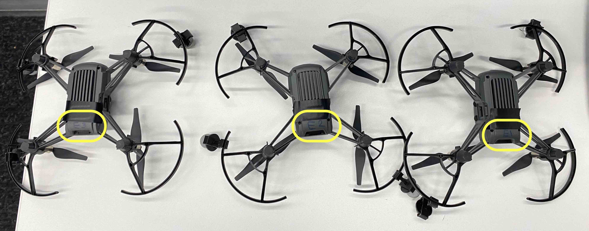
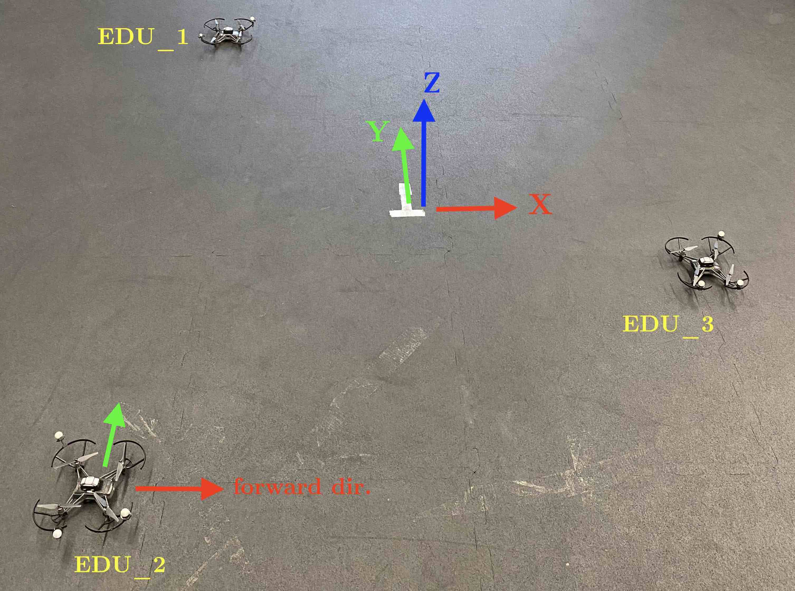
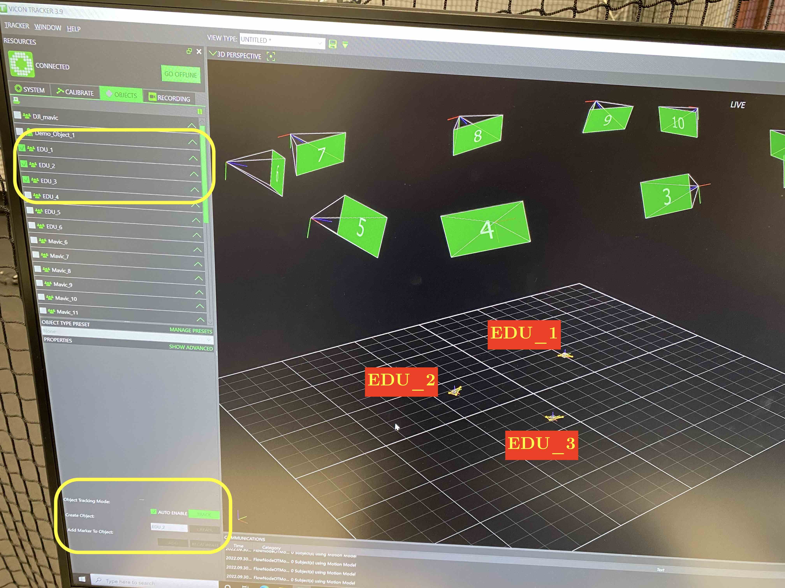
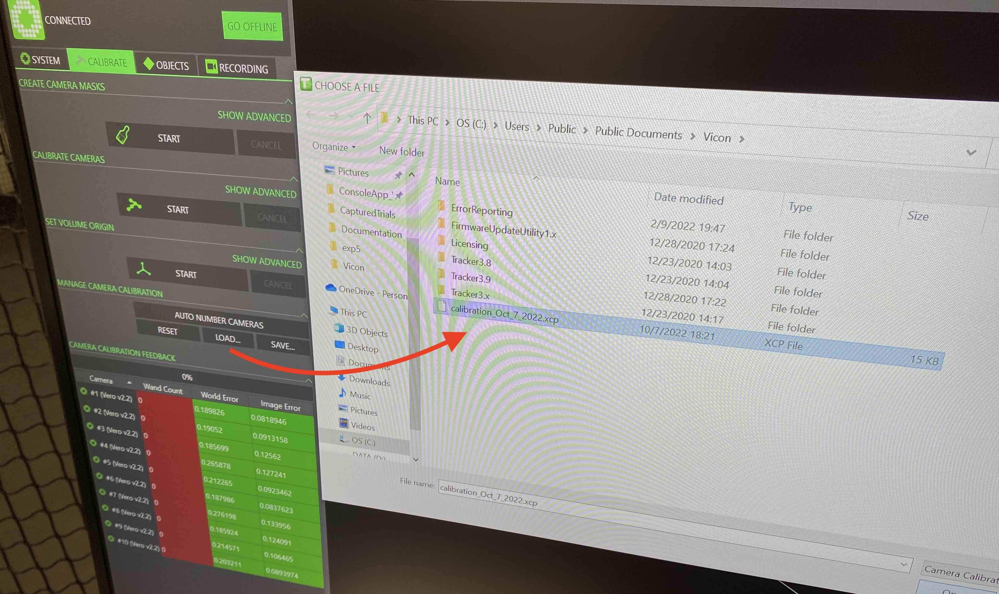
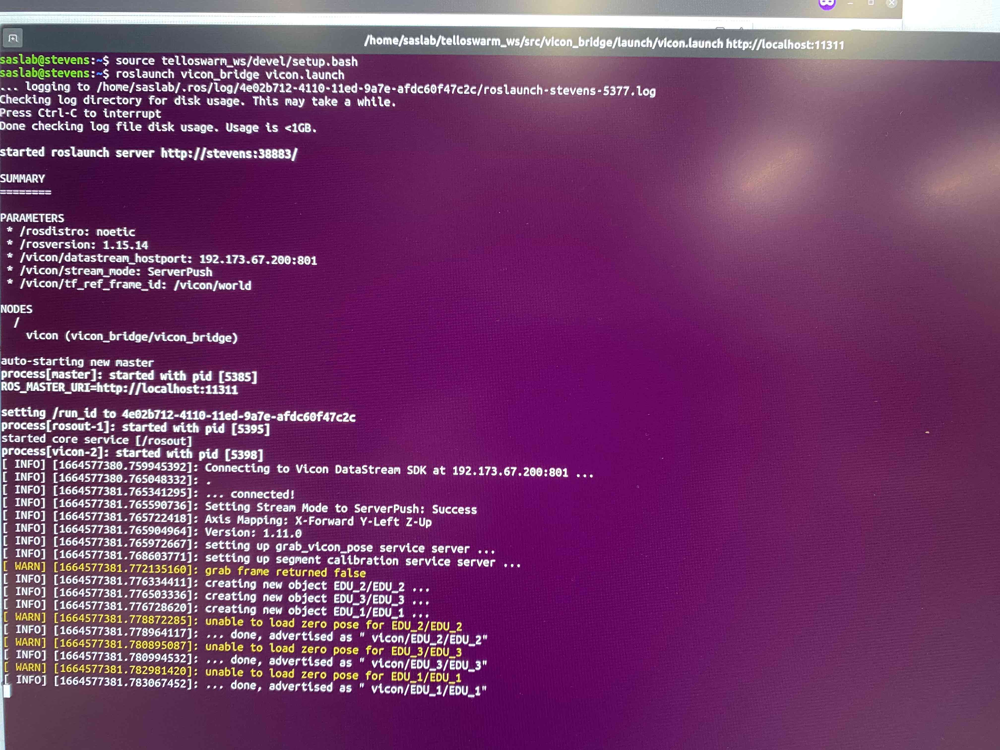

# demo_TelloEDU


## Prepration 

1. pick the three Tello EDUs that are marked by `E1`,`E2`,`E3`, and place them in a circular shape, as pictured, around the T-zone of the flight area. The drone's Front(x) Left(y) Up(z) should be aligned with the XYZ of global frame.

<p align="center">


</p>


2. make sure the Tello EDUs, `E1`,`E2`,`E3`, are defined in the VICON Tracker as objects named ``EDU_1``, ``EDU_2``, ``EDU_3``, respectively. Also make sure the ``AUTO ENABLE`` and ``TRACK`` are activated.

<p align="center">

</p>

- If not calibrated already, a calibration file can be loaded to use in VICON Tracker. (update of OCT. 7th.)
<p align="center">

</p>

3. open a terminal and run 

 ```
  source telloswarm_ws/devel/setup.bash
 ```
 
then run
 
 ```
 roslaunch vicon_bridge vicon.launch
 ```
 
 which gives VICON data 
 
<p align="center">

</p>
 
 
 ### run tests
 
 0. assumming ``roslaunch vicon_bridge vicon.launch`` in step 3 of prepration is running.
 
 1. open a new terminal and run
 
 ```
 python3 telloswarm_ws/src/TelloSwarm/scripts/demo_circle_EDU.py
 ```
 
 the drones take off and start flying in a circle for ~33 sec and then land.


### a few notes

 - to repeat the experiment, restart the EDU drones by shuting them off and on and run the previous python command again.

 - before each experiment make sure the propellers or the markers are not loose!

 - the HP workstation has been connected via Ethernet cable to the router, make sure they are not disconnected.

 - the Tello EDUs marked by `E1`,`E2`,`E3`, are defined in the router with static IP addresses. If other drones are required to be used, further configuration is required.
